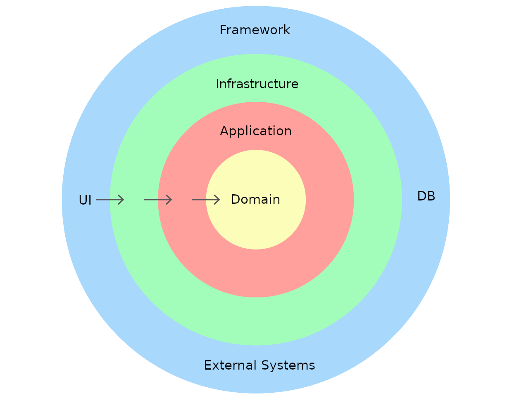

Este projeto traz boas práticas para a construção de novos módulos de micro-serviços, com o intuito de uma padronização, melhor manutenabilidade e disseminação da cultura de testes automatizados.

## Design

Foi aplicado o design de arquitetura "Clean Architecture", pois facilita a separação do negócio (core) das regras de infraestrutura (frameworks, clouds, etc).



A camada externa acessa a camada interna, utilizando a injeção de dependência, é possível isolar o core da aplicação dos frameworks utilizados.

Dentro do diretório `src` possuem 3 diretórios principais (domain, infra e main), além do diretório utils.

### Domain

Este diretório deve carregar somente o core da aplicação, como os UseCases, entidades de negócio e interfaces de repositório.

Para este exemplo, cada usecase foi colocado em um diretório distinto, para agrupar com os dominios de input/output e tornar mais limpo a visualização.

Cada usecase deve possuir apenas uma função pública, para que ele não acabe incorporando mais função que o necessário, desta forma facilita a manutenção e criação do teste do mesmo.

## Infra

Neste diretório temos tudo que se enquadra a infra, como conexão com banco de dados, definição de rotas, consumidor de filas, etc.

Desta forma, dentro desse diretório separei alguns diretórios para facilitar a visualização, sendo eles:

- controllers: Faz a ponte entre o handle principal e os usecases, como exemplo a definição de rotas, consumidor de fila ou uma interface de console.
- gateways: Implementação de cada repositório de dados definidos em domains
- helpers: (Opcional) Classes que facilitam a utilização de recursos de infra dentro dos gateways ou controllers. Geralmente devem ser movidos para libs após pouco tempo.
- services: Utilizar apenas quando houver a necessidade de executar uma sequencia de Usecases em uma mesma transação.

## Main

Este diretório contem os handlers de inicialização do projeto, sejam um listen do servidor http, um handle lambda ou uma UI para console.

## utils

Este diretório deve ser usado com moderação da mesma forma que o helpers, pensando sempre em mover para libs, porém fica disponivel tanto para domains, quanto para infra.

[swagger](docs/openapi.yml)

#### Resumo da Documentação da API

##### Visão Geral

Esta documentação da API descreve os pontos finais e estruturas de dados para uma aplicação de serviços financeiros. A API permite que os usuários gerenciem produtos, clientes, contribuições para planos, resgates de planos e os próprios planos.

Pontos Finais

- Criar Produto

  - Ponto Final: POST /products
  - Resumo: Criar um novo produto financeiro.
  - Payload da Solicitação:
  - nome (string): Nome do produto.
  - susep (string): Número SUSEP (Superintendência de Seguros Privados).
  - expiracaoDeVenda (string, data-hora): Data e hora de expiração das vendas.
  - valorMinimoAporteInicial (number): Valor mínimo do depósito inicial.
  - valorMinimoAporteExtra (number): Valor mínimo do depósito adicional.
  - idadeDeEntrada (integer): Idade mínima para entrar.
  - idadeDeSaida (integer): Idade máxima para sair.
  - carenciaInicialDeResgate (integer): Período inicial de carência para resgate.
  - carenciaEntreResgates (integer): Período de carência entre resgates.
  - Resposta: O objeto de produto criado.

- Criar Cliente

  - Ponto Final: POST /customers
  - Resumo: Criar um novo cliente.
  - Payload da Solicitação:
  - cpf (string): Número de CPF do cliente.
  - nome (string): Nome do cliente.
  - email (string, email): Endereço de e-mail do cliente.
  - dataDeNascimento (string, data-hora): Data de nascimento do cliente.
  - genero (string): Gênero do cliente.
  - rendaMensal (number): Renda mensal do cliente.
  - Resposta: O objeto de cliente criado.

- Contribuir para um Plano

  - Ponto Final: POST /plans/contribution
  - Resumo: Contribuir para um plano financeiro.
  - Payload da Solicitação:
  - idCliente (string): ID do cliente.
  - idPlano (string): ID do plano.
  - valorAporte (number): Valor da contribuição.
  - Resposta: Detalhes da contribuição.

- Resgatar de um Plano

  - Ponto Final: POST /plans/redeem
  - Resumo: Resgatar fundos de um plano financeiro.
  - Payload da Solicitação:
  - idCliente (string): ID do cliente.
  - idPlano (string): ID do plano.
  - valorResgate (number): Valor do resgate.
  - Resposta: Detalhes do resgate.

- Criar Plano
  - Ponto Final: POST /plans
  - Resumo: Criar um novo plano financeiro.
  - Payload da Solicitação:
  - idCliente (string): ID do cliente.
  - idProduto (string): ID do produto.
  - aporte (number): Valor da contribuição do plano.
  - dataDaContratacao (string, data-hora): Data e hora do contrato do plano.
  - idadeDeAposentadoria (integer): Idade de aposentadoria.
  - Resposta: O objeto de plano criado.
  - Estruturas de Dados
  - A API utiliza as seguintes estruturas de dados:

---

- **Product**: Representa informações sobre previdência privada.
- **Customer**: Representa informações sobre clientes.
- **Contribution**: Representa dados de contribuição para um plano.
- **Redemption**: Representa dados de resgate de um plano.
- **Plan**: Representa informações sobre planos financeiros.

Notas

Todos os valores de data e hora estão no formato ISO com fuso 0 hora.

CPF é o número de registro de contribuinte brasileiro.

SUSEP é o número da Superintendência de Seguros Privados.

Esta documentação da API fornece detalhes sobre como interagir com a API de serviços financeiros,
permitindo que os usuários gerenciem produtos, clientes, contribuições, resgates e planos financeiros.


[Board](https://github.com/users/embura/projects/3/views/1)
---------------
# Iniciando o projeto

Este projeto pode ser utilizado tanto com yarn quanto npm, porém os exemplos serão apresentados utilizando yarn como o gerenciador padrão.

Projeto pensado para ser executado em lambda


Primeiro instale as dependências:


Inicia aplicação

subir container do mongo e seu client web:
```
docker compose -f mongo.yml up -d
```

```
yarn
```

```
yarn start:lambda
```


#
Testes:

```shell
yarn test:unit

yarn test:integration

yarn test:cov
```
#


